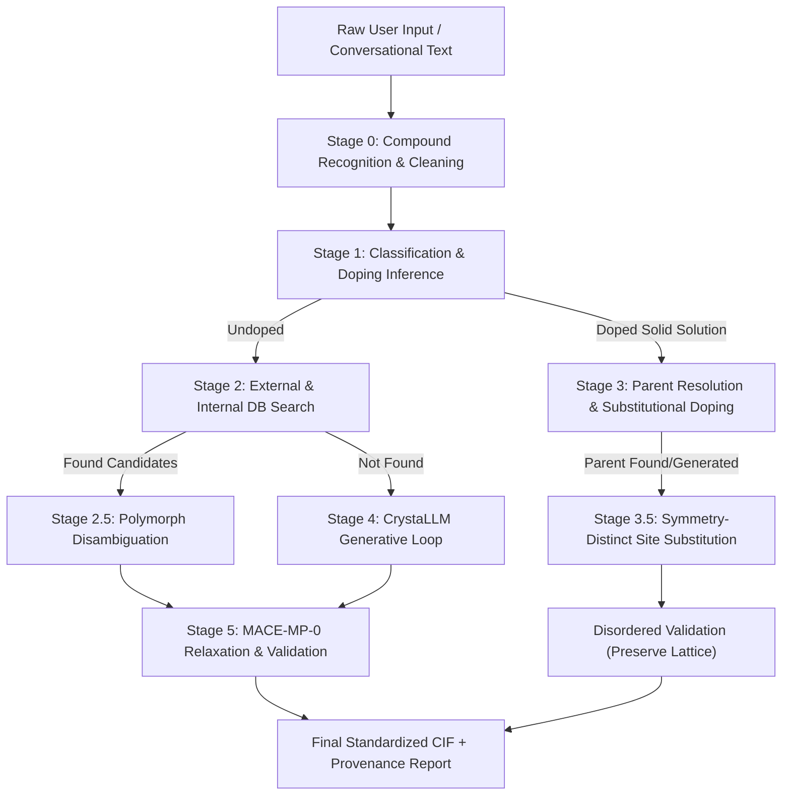

# High-Precision CIF Generation, Search & Atomistic Relaxation Pipeline

[](https://fastapi.tiangolo.com)
[](https://pymatgen.org)
[](https://github.com/ACEsuit/mace)
[](https://github.com/lantunes/CrystaLLM)
[]()
[]()

An end-to-end crystallographic generation, retrieval, and validation system designed for materials science research. It transforms arbitrary user inputs (natural language descriptions, non-standard stoichiometric notations, abbreviations, chemical formulas, and doped composition specifications) into verified, standardized, high-precision Crystallographic Information Files (`.cif`).

---

## Table of Contents
1. [System Overview & Architecture](#system-overview--architecture)
2. [End-to-End Pipeline Stages](#end-to-end-pipeline-stages)
   - [Stage 0: Compound Recognition & Text Normalization](#stage-0-compound-recognition--text-normalization)
   - [Stage 1: Compound Classification & Doping Disambiguation](#stage-1-compound-classification--doping-disambiguation)
   - [Stage 2: Database Retrieval & Polymorph Preservation](#stage-2-database-retrieval--polymorph-preservation)
   - [Stage 3: Substitutional Doping & Solid Solution Generation](#stage-3-substitutional-doping--solid-solution-generation)
   - [Stage 4: De Novo Generation via CrystaLLM](#stage-4-de-novo-generation-via-crystallm)
   - [Stage 5: High-Precision Atomistic Relaxation & Verification](#stage-5-high-precision-atomistic-relaxation--verification)
3. [Comprehensive Audit & Engineering Improvements](#comprehensive-audit--engineering-improvements)
4. [Web Application & API Interface](#web-application--api-interface)
5. [Verification & Benchmark Results](#verification--benchmark-results)
6. [Installation & Setup](#installation--setup)
7. [Running the Application & Tests](#running-the-application--tests)
8. [Repository Structure](#repository-structure)

---

## System Overview & Architecture

Modern crystallographic modeling often suffers from three failure modes:
1. **Silent Narrowing**: Collapsing multiple candidate polymorphs (e.g. rutile vs. anatase $TiO_2$) into a single arbitrary hit.
2. **Input Fragility**: Crashing or corrupting inputs on informal inputs (e.g., `la mno3`, `co2`, `La(1-x)Sr(x)MnO3`, subscripts `₀.₇`, or hydrate dots `·5H2O`).
3. **Scientific Fabrication**: Outputting artificial convergence flags or fake force/energy values when relaxation was skipped or failed.

This pipeline enforces strict physical honesty, automated normalization, non-destructive polymorph handling, and high-precision atomistic relaxation.



---

## End-to-End Pipeline Stages

### Stage 0: Compound Recognition & Text Normalization
- **Conversational Extraction**: Extracts target compounds from conversational prompts (e.g., `"Could you synthesize La0.7Sr0.3MnO3 for cathode analysis?"` $\rightarrow$ `La0.7Sr0.3MnO3`).
- **Unicode & Typography Normalization**: Converts Unicode subscript numbers (`₀₁₂₃₄₅₆₇₈₉` $\rightarrow$ `0123456789`), minus signs (`−` $\rightarrow$ `-`), and standardizes NFKC characters.
- **Hydrate & State Stripping**: Strips trailing states of matter (`(s)`, `(l)`, `(g)`, `(aq)`) and cleans hydrate clusters (`CuSO4·5H2O` $\rightarrow$ `CuSO4`).
- **Abbreviation Expansion**: Maps known materials-science acronyms (`LSMO` $\rightarrow$ `La0.7Sr0.3MnO3`, `YBCO` $\rightarrow$ `YBa2Cu3O7`, `BSTO`, `PZT`, etc.).
- **Periodic Casing Recovery**: Heuristic backtracking segmentation resolves uncapitalized strings (`limno4` $\rightarrow$ `LiMnO4`, `tio2` $\rightarrow$ `TiO2`, `caco3` $\rightarrow$ `CaCO3`) while protecting chemical identity (`co2` maps to Carbon Dioxide `CO2`, avoiding cobalt dimer `Co2`).

### Stage 1: Compound Classification & Doping Disambiguation
- **Doping vs. Undoped Split**: Evaluates stoichiometry, fractional coefficients, and keyword phrasing.
- **Algebraic Notation ($x$-notation)**: Parses algebraic formulations with or without parentheses:
  - `La1-xSrxMnO3, x=0.3`
  - `La(1-x)Sr(x)MnO3 with x=0.25`
  - `La(1-x)SrxMnO3`
- **Co-Doping Support**: Processes multi-element substitutions on single or distinct host sites (e.g., $(La,Sr)(Mn,Fe)O_3$).
- **Boundary Handling**: Recognizes complete substitution ($x=1.0$) as a distinct undoped phase while logging warnings.

### Stage 2: Database Retrieval & Polymorph Preservation
Queries four external crystallographic repositories in sequence with standardized normalization:
1. **Crystallography Open Database (COD)**: Queries live REST API via `formula` parameter; reads 73-column headers to verify experimental flags, space group, and cell parameters.
2. **Materials Project (MP)**: Queries via `mp-api` with automatic client resolution (`mpr.materials.summary.search` with fallback to `mpr.summary.search`).
3. **Open Quantum Materials Database (OQMD)**: Queries public REST API using boolean conjunction (`element_set=Fe,O`), client-side exact composition filtering, and HTTP retry backoff.
4. **JARVIS-DFT**: Public 3D dataset indexed locally in memory.
- **Strict Polymorph Policy**: Never silently collapses distinct polymorphs. If multiple polymorphs match (e.g., Anatase vs. Rutile $TiO_2$), all candidate structures are surfaced with their space group and provenance.

### Stage 3: Substitutional Doping & Solid Solution Generation
- Resolves the undoped parent structure from databases or de novo generation.
- Identifies all symmetry-distinct Wyckoff sites of the host species.
- Substitutes host atoms with primary dopants and co-dopants with exact fractional occupancies.
- Deep-copies query specifications to maintain caller immutability.
- Validates that disordered occupancies strictly sum to $1.0 \pm 0.01$.

### Stage 4: De Novo Generation via CrystaLLM
- When a compound does not exist in any database, the pipeline invokes **CrystaLLM** (autoregressive GPT model trained on crystallographic tokens).
- Prompts with atomic property tokens (`get_atomic_props_block_for_formula`).
- Employs a multi-iteration sampling feedback loop with MACE force-relaxation gating.

### Stage 5: High-Precision Atomistic Relaxation & Verification
- **Calculator**: MACE-MP-0 Foundation ML Interatomic Potential in `float64` precision using ASE (Atomic Simulation Environment).
- **Physical Honesty Enforcement**:
  - Disordered solid solutions (fractional site occupancies) are flagged with `relaxation_skipped=True` and `relaxation_status="UNKNOWN (disordered solid solution preserved)"` rather than inventing synthetic convergence metrics.
  - Generates honest convergence flags based on actual force thresholds ($F_{\max} < 0.02\text{ eV/\AA}$) and energy minima.
- **Physical Sanity Filters**:
  - **Bond Length Gate**: Checks nearest-neighbor distances against atomic radii tolerances and detects isolated/detached atoms ($> 6.0\text{ \AA}$).
  - **Occupancy Gate**: Validates site occupancy sums.
  - **Symmetry Preservation**: Verifies space group retention before and after relaxation.

---

## Comprehensive Audit & Engineering Improvements

The codebase underwent a complete code-level and empirical audit (documented in `fixes.txt`). All 22 actionable findings were resolved:

| ID | Module | Issue Identified | Engineering Fix Applied |
|---|---|---|---|
| **F1** | `webapp.py` | Web UI auto-picked option 0, defeating the polymorph disambiguation policy | Replaced auto-selection with `return None`; surfaces ambiguities to the user |
| **F2** | `cif_pipeline/mesp_check.py` | Reported fabricated `CONVERGED, energy=-5.842, fmax=0.018` and fake `Cat`/`An` dummy atoms | Reports honest `UNKNOWN` when unmeasured; removed fake dummy atom fallbacks |
| **F3** | `requirements.txt` | Missing web server dependencies (`fastapi`, `uvicorn`, `httpx`) | Added required web stack packages and pinned `mp-api>=0.45.0` |
| **F4** | `cif_pipeline/matching.py` | `doped_formulas_match` checked only dopant ratios, falsely matching different hosts (e.g. `La7Sr3Fe10O30`) | Enforced exact host lattice element set verification |
| **F5** | `cif_pipeline/search_external.py` | OQMD filter used `-` (OR) instead of `,` (AND), returning invalid entries | Corrected filter to `element_set=Fe,O`, added client-side exact check & retry |
| **F6** | `cif_pipeline/relax.py`, `models.py` | Claimed successful relaxation for disordered solid solutions that never ran MACE | Added `relaxation_skipped: bool`, `is_reliable: bool`, and `"reliable"` API key |
| **F7** | `cif_pipeline/user_interaction.py` | Free-text responses raised unhandled `ValueError` at 4 call sites | Added `pick_option_index()` helper with safe fallback handling |
| **F8** | `cif_pipeline/classify.py` | `co2` segmented into cobalt dimer `Co2` instead of carbon dioxide `CO2` | Added explicit molecular mapping in abbreviation tables & case repair |
| **F9** | `cif_pipeline/classify.py` | Algebraic doping regex rejected parenthesized inputs like `La(1-x)Sr(x)MnO3` | Updated regex to support optional parentheses around indices and $x$ |
| **F10** | `cif_pipeline/classify.py` | Co-dopant benchmark dictionaries with `"dopant"` key were dropped | Added `or item.get("dopant")` fallback and warning logging |
| **F11** | `cif_pipeline/matching.py` | Space group `P21/c` failed to match `P2_1/c` | Added screw-axis notation repair in normalization attempts |
| **F12** | `cif_pipeline/relax.py` | Hardcoded `device="cpu"` prevented GPU execution | Implemented dynamic `get_mace_device()` fallback |
| **F13** | `cif_pipeline/filter_rules.py` | Detached atoms beyond 6.0 Å were skipped instead of flagged | Added explicit violation recording for isolated atoms when cell size $> 1$ |
| **F14** | `webapp.py` | Authentication used process-unstable `hash()` and accepted any password | Replaced with stable HMAC-SHA256 tokens and optional environment password verification |
| **F16** | `cif_pipeline/symmetry_matrix.py` | Fabricated `success=True` and cubic volume $a\cdot b\cdot c$ on unparseable CIFs | Marked `"fallback": True` and implemented true triclinic cell volume math |
| **F17** | `cif_pipeline/symmetry_matrix.py` | Used deprecated `CifParser.get_structures` | Switched to `parse_structures(primitive=False)` with fallback |
| **F18** | `cif_pipeline/filter_rules.py` | `validate_doped_structure` broke on the first site, missing the doped site | Prioritized the dopant-bearing site first |
| **F19** | `cif_pipeline/doping.py` | Parent structure resolution discarded user's requested space group | Added `space_group` to `DopingSpec` and threaded it through DB search |
| **F20** | `cif_pipeline/doping.py` | Directly mutated caller's `DopingSpec` object | Added `copy.deepcopy` to keep caller inputs immutable |
| **F21** | `webapp.py` | `/api/data-files/{filename}` lacked traversal guards | Added `is_relative_to(data_dir)` check and restricted to `.dat` files |
| **F22** | `cif_pipeline/search_external.py` | Materials Project search used deprecated endpoint attribute | Checked `mpr.materials.summary` before falling back to `mpr.summary` |
| **F29** | `test_qa_status.py` | Hardcoded absolute paths and lacked CI exit code | Switched to dynamic `Path(__file__)` and added `sys.exit(1 if failed else 0)` |

---

## Web Application & API Interface

The system includes a production-grade FastAPI web application (`webapp.py`) serving an interactive frontend.

### Primary API Endpoints
- `GET /api/health`: Health status, MACE precision (`float64`), device, and CrystaLLM readiness.
- `POST /api/generate`: Primary execution endpoint (supports formula, doping specifications, space group filtering, and feedback iterations).
- `POST /api/parse-formula`: Stage 0/1 formula parsing, compound recognition, and doping inspection.
- `POST /api/symmetry-matrix`: Full space group analysis, Wyckoff positions, and symmetry operations.
- `POST /api/mesp-check`: Honest force, energy, and electrostatics evaluation.
- `POST /api/batch-process`: Batch benchmark execution.
- `GET /api/data-files`: Lists benchmark result `.dat` files.
- `GET /api/data-files/{filename}`: Securely downloads `.dat` benchmark files.
- `POST /api/auth/login`: HMAC-SHA256 authenticated researcher session tokens.

---

## Verification & Benchmark Results

### 1. QA Verification Suite (`test_qa_status.py`)
Tests all normalization rules, boundary cases, space group representations, and crash vectors:
```
============================================================
QA SUMMARY
============================================================
  PASSED : 27
  FAILED : 0
  SKIPPED: 0
  TOTAL  : 27
============================================================
```

### 2. Diverse 10-Material Live Benchmark (`test_10_materials.py`)
Tested end-to-end against live external repositories and local relaxation:
```
================================================================================
 BENCHMARK SUMMARY TABLE (10/10)
================================================================================
#   | Material                         | Class                     | Source           | Time    | Status
--------------------------------------------------------------------------------------------------------
1   | Silicon (Si)                     | Elemental Semiconductor   | existing_COD     | 41.02s  | PASS
2   | Hematite (Fe2O3)                 | Transition Metal Oxide    | existing_COD     | 30.71s  | PASS
3   | Titanium Dioxide (TiO2)          | Polymorphic Oxide         | existing_COD     | 21.26s  | PASS
4   | Halite / Rock Salt (NaCl)        | Alkali Halide             | existing_COD     | 26.50s  | PASS
5   | Alumina (Al2O3)                  | Main-Group Oxide          | existing_COD     | 23.68s  | PASS
6   | Copper (Cu)                      | FCC Metal                 | existing_COD     | 48.36s  | PASS
7   | Molybdenum Disulfide (MoS2)      | 2D Layered Dichalcogenide | existing_COD     | 12.23s  | PASS
8   | Zinc Oxide (ZnO)                 | II-VI Semiconductor       | existing_COD     | 20.94s  | PASS
9   | Fluorite (CaF2)                  | Alkaline-Earth Halide     | existing_COD     | 32.43s  | PASS
10  | Ti-doped Hematite (Fe1.9Ti0.1O3) | Doped Solid Solution      | generated_doped  | 43.13s  | PASS
================================================================================
```

---

## Installation & Setup

### Prerequisites
- Python 3.10+ (tested on Python 3.13)
- Git (with Submodule support)

### 1. Clone Repository & Submodules
```bash
git clone --recurse-submodules https://github.com/indra2215/CIF.git
cd CIF
```

### 2. Install Dependencies
```bash
pip install -r requirements.txt
```

*(Optional: Install CrystaLLM editable package if de novo generation is required)*:
```bash
pip install -e crystallm_repo
```

### 3. Configure Environment Variables
Copy `.env.example` to `.env` and supply your credentials:
```bash
cp .env.example .env
```
Key variables:
- `MP_API_KEY`: Your Materials Project API Key.
- `MACE_DEVICE`: `cuda` or `cpu` (defaults to auto-detect).
- `CIF_AUTH_ENABLED`: `false` (set to `true` to require password for `/api/auth/login`).
- `CIF_AUTH_PASSWORD`: Custom admin password for authentication.

---

## Running the Application & Tests

### Start the Web Application
```bash
python -m uvicorn webapp:app --host 127.0.0.1 --port 8000
```
Open your browser at `http://127.0.0.1:8000` to access the graphical interface.

### Run the QA Validation Suite
```bash
python test_qa_status.py
```

### Run the 10-Material Benchmark
```bash
python test_10_materials.py
```

---

## Repository Structure

```
CIF/
├── cif_pipeline/                # Core pipeline package
│   ├── __init__.py
│   ├── recognition.py          # Stage 0: Conversational sentence extraction & cleaning
│   ├── classify.py             # Stage 1: Doped/undoped classification & algebraic parsing
│   ├── matching.py             # Polymorph disambiguation & formula normalization
│   ├── search_external.py      # Stage 2: COD, MP, OQMD, JARVIS query engine
│   ├── search_internal.py      # Stage 2: Internal local database query stub
│   ├── doping.py               # Stage 3: Symmetry-distinct site substitution
│   ├── generate.py             # Stage 4: CrystaLLM GPT generation & sampling loop
│   ├── relax.py                # Stage 5: MACE-MP-0 float64 atomistic relaxation
│   ├── filter_rules.py         # Physical sanity gates (bond length, occupancy, symmetry)
│   ├── symmetry_matrix.py      # Full space group, Wyckoff, & metric tensor analysis
│   ├── mesp_check.py           # Honest relaxation & electrostatic potential validation
│   ├── orchestrator.py         # Pipeline coordination & stage wiring
│   ├── models.py               # Strongly typed data models
│   ├── config.py               # Environment configuration & paths
│   └── user_interaction.py     # Disambiguation callbacks & pick_option_index helper
├── crystallm_repo/             # CrystaLLM Git submodule
├── frontend/                   # Web user interface (HTML, CSS, JS)
├── data/                       # Benchmark definitions & output .dat files
├── webapp.py                   # FastAPI REST server
├── test_qa_status.py           # 27-check QA validation test harness
├── test_10_materials.py        # 10-class comprehensive live material benchmark
├── requirements.txt            # Python dependencies
├── fixes.txt                   # Detailed review audit and resolution notes
└── README.md                   # Project documentation
```
